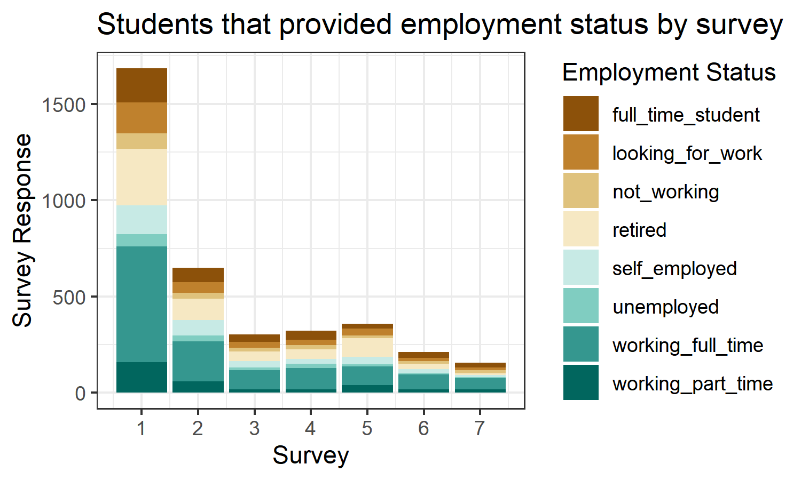

```{r setup, include=FALSE}
knitr::opts_chunk$set(echo = FALSE)
knitr::opts_knit$set(root.dir= normalizePath('..'))
```

```{r include=FALSE}
# Load project
library("ProjectTemplate")
load.project()
# Run code in analysis.R script
source("src/01 - Analysis.R")
```

# Contents

This is an R Markdown presentation, summarising the Exploratory_Analysis project conducted by Issy Middleton for CSC8631 - Data Management & Exploratory Analysis.
<p>&nbsp;</p>
* Looking at the data 
* Deciding on an area of interest
* Using ProjectTemplate
* Version Control
* Pre-processing
* Starting the analysis
* Removing duplicates
* Refining graphs 
* Loading into an RMarkdown report

# Looking at the data - names, size, types


# Deciding on an area of interest

I loaded sample data into RStudio and started looking at the data using R commands (head, summary, glimpse). It was possible to determine the size of the tables, the types of data that had been captured and see missing items. I decided to investigate students’ willingness to share personal data at enrolment, given that the course was related to security. 

Sample row and columns:

```{r cyber.security.1_enrolments, echo = FALSE,}
cyber.security.1_enrolments[1:3,2:4]
```

# Using ProjectTemplate


# Version control 

Syncing RStudio with my GitHub account allowed me to use Git for version control, by using Commit and Push. I created an new repository on GitHub, set up the security credentials under my profile and saved the public key into my version of RStudio. I downloaded Git and linked a new .RProj file. 

Git provides the functionality to control file versions and GitHub is a platform for hosting Git repositories.

# Pre-processing

The pre-processing scripts (or data munging code) are stored in `munge` folder and will be executed sequentially when load.project()` is called. Numbers within filenames indicate the sequential order of the scripts. The scripts:

- add columns at runtime, merge data sets and adjust data formats
- remove duplicate records where learner_id is not unique, calculating course duration between first and last enrolment date
- filters the data by groups of students willing to share data
- categorises data
- provides additional data items on duplicate records
- calculates volume of shared data items 
- determines counts and percentages of data that it shared by student, by survey
- and calculates counts and percentage of data that is not shared 

# Starting the analysis


# Removing duplicates


# Attitudes to sharing


# Common findings


# Test Table

Survey No.|    Date First Student Enrolled   | Date Last Student Enrolled       |Duration (days) | No. of Students
--------|-----------------------------|------------------------------|--------------| ----------
1   |  `r (cyber1firststudentreport)` | `r (cyber1laststudentreport)`|`r format(cyber1durationdaysunique)` | `r (count1unique)`
2   |  `r (cyber2firststudentreport)` | `r (cyber2laststudentreport)`|`r format(cyber2durationdaysunique)` | `r (count2unique)`
3   |  `r (cyber3firststudentreport)` | `r (cyber3laststudentreport)`|`r format(cyber3durationdaysunique)` | `r (count3unique)`
4   |  `r (cyber4firststudentreport)` | `r (cyber4laststudentreport)`|`r format(cyber4durationdaysunique)` | `r (count4unique)`
5   |  `r (cyber5firststudentreport)` | `r (cyber5laststudentreport)`|`r format(cyber5durationdaysunique)` | `r (count5unique)`
6   |  `r (cyber6firststudentreport)` | `r (cyber6laststudentreport)`|`r format(cyber6durationdaysunique)` | `r (count6unique)`
7   |  `r (cyber7firststudentreport)` | `r (cyber7laststudentreport)`|`r format(cyber7durationdaysunique)` | `r (count7unique)`


# Key Findings


# Refining graphs


# Loading into an RMarkdown report

I used the RMarkdown file to generate a report to be stored in the Reports section of the project file structure. During the generation of graphs and tables I returned to the data preparation phase frequently. Regularly, I would update the Git version control by using a Commit and Push commands. 