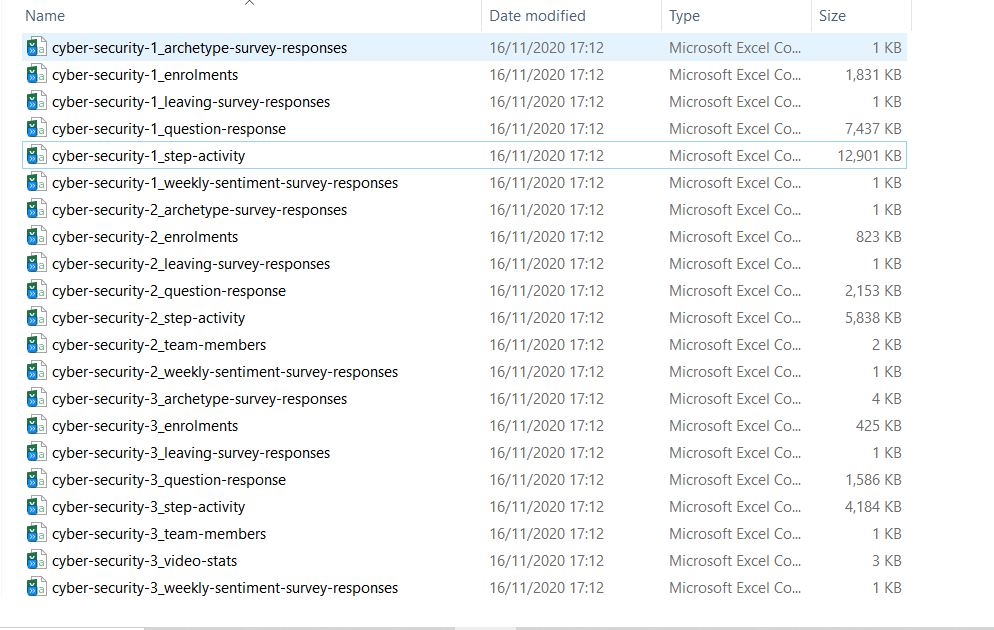
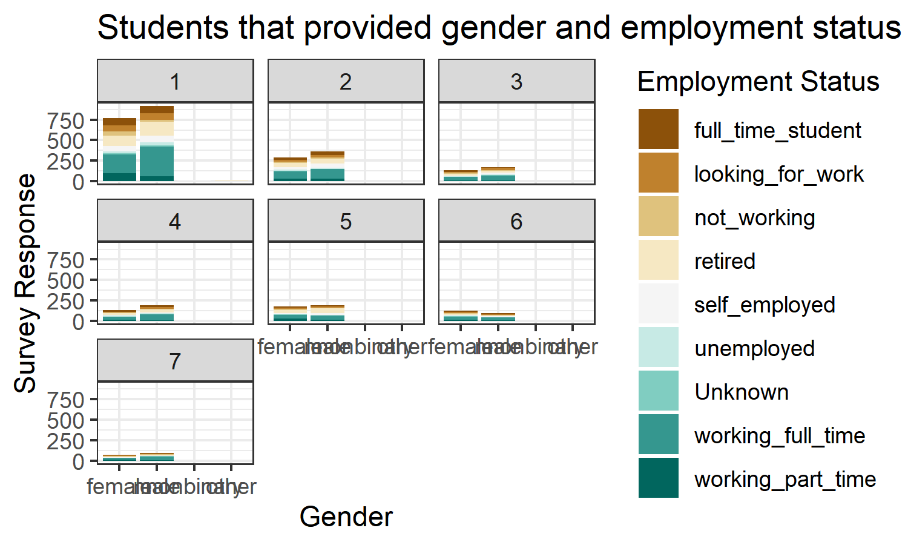
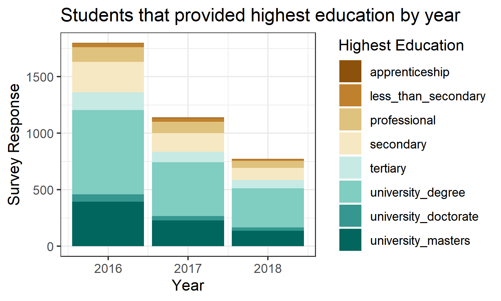
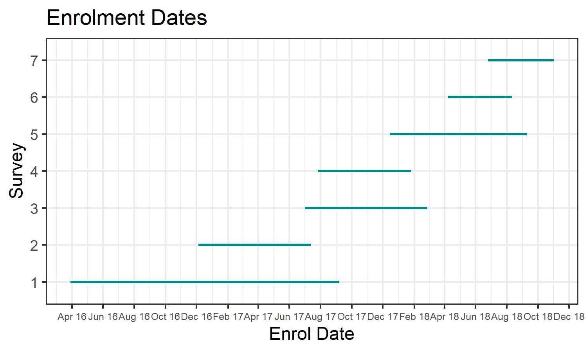
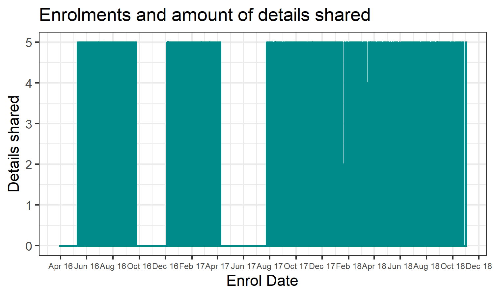

```{r setup, include=FALSE}
knitr::opts_chunk$set(echo = FALSE)
knitr::opts_knit$set(root.dir= normalizePath('..'))

```

```{r include=FALSE}
# Load project
library("ProjectTemplate")
load.project()
# Run code in analysis.R script
source("src/01 - Analysis.R")
```

# Contents

* Data Understanding 
  - Looking at the data 
  - Deciding on an area of interest
* Setting up 
  - ProjectTemplate and Version Control
* Data Preparation & Modeling
  - Pre-processing script development
  - Developing the analysis
  - Removing duplicates
* Modeling & Evaluation
  - Refining graphs
  - Adding to pre-processing
* Deployment
  - Loading into an RMarkdown report

# Looking at the data - names, size, types



# Deciding on an area of interest

By loading a few data files into RStudio and using R commands (head, summary, glimpse) it was possible to determine the size of the tables, the types of data that had been captured and see missing items. 

The enrolment files contained details of gender, employment and age so I decided to investigate students’ willingness to share personal data at enrolment, given that the course was related to security. 

Sample row and columns:

```{r cyber.security.1_enrolments, echo = FALSE,}
cyber.security.1_enrolments[1:3,3:4]
```

# Setting up - ProjectTemplate and Git


# Data Preparation - initial

The pre-processing scripts (or data munging code) are stored in `munge` folder and will be executed sequentially when load.project()` is called. 

Numbers within filenames indicate the sequential order of the scripts. 

The initial scripts were:

- adding columns at runtime, merging data sets, adjusting data formats
- filtering the data by groups of students willing to share data
- categorising data
 
# Initial Modeling - quick charts



# Identifying more data processing



# Course details

Survey No.|    Date First Student Enrolled   | Date Last Student Enrolled       |Duration (days) | No. of Students
--------|-----------------------------|------------------------------|--------------| ----------
1   |  `r (cyber1firststudentreport)` | `r (cyber1laststudentreport)`|`r format(cyber1durationdaysunique)` | `r (count1unique)`
2   |  `r (cyber2firststudentreport)` | `r (cyber2laststudentreport)`|`r format(cyber2durationdaysunique)` | `r (count2unique)`
3   |  `r (cyber3firststudentreport)` | `r (cyber3laststudentreport)`|`r format(cyber3durationdaysunique)` | `r (count3unique)`
4   |  `r (cyber4firststudentreport)` | `r (cyber4laststudentreport)`|`r format(cyber4durationdaysunique)` | `r (count4unique)`
5   |  `r (cyber5firststudentreport)` | `r (cyber5laststudentreport)`|`r format(cyber5durationdaysunique)` | `r (count5unique)`
6   |  `r (cyber6firststudentreport)` | `r (cyber6laststudentreport)`|`r format(cyber6durationdaysunique)` | `r (count6unique)`
7   |  `r (cyber7firststudentreport)` | `r (cyber7laststudentreport)`|`r format(cyber7durationdaysunique)` | `r (count7unique)`

# Data Preparation - continuing

The later scripts included:

- calculating volume of shared data items 
- determining counts and percentages of data that it shared by student, by survey
- calculating counts and percentage of data that is not shared 

# Modeling - attitudes to sharing


# Evaluation (using counts)

Survey No. | % of Students | Ave. Items
-----------|------------------------| ------------------------
1   |   `r (Percent1)`    | `r (Amount_Shared1)`  
2   |   `r (Percent2)`    | `r (Amount_Shared2)`    
3   |   `r (Percent3)`    | `r (Amount_Shared3)`
4   |   `r (Percent4)`    | `r (Amount_Shared4)`
5   |   `r (Percent5)`    | `r (Amount_Shared5)`
6   |   `r (Percent6)`    | `r (Amount_Shared6)`
7   |   `r (Percent7)`    | `r (Amount_Shared7)`
ls

# Enrolments


# Details shared over time


# Deployment - creating a report

I used the RMarkdown file to generate a report to be stored in the Reports section of the project file structure. During the generation of graphs and tables I returned to the data preparation phase frequently. Regularly, I would update the Git version control by using a Commit and Push commands. 